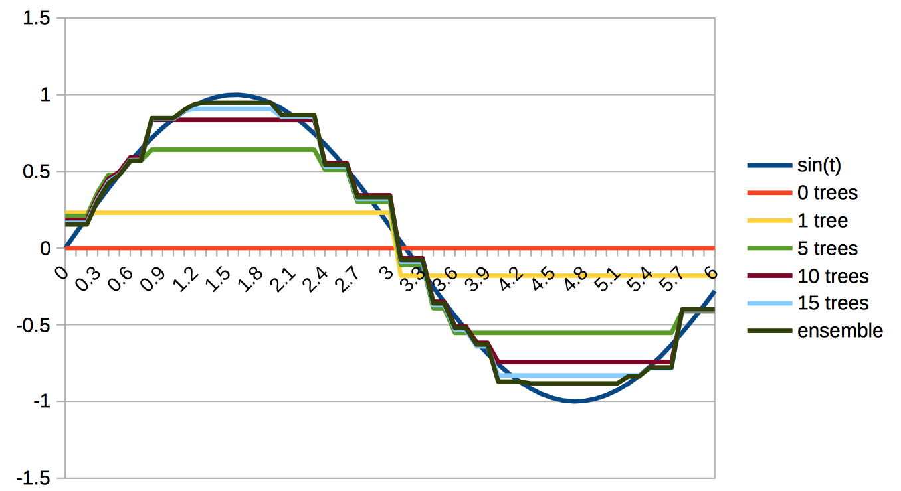

# Implementing Gradient Boosted Trees

In this post I will share my experience on implementing
gradient boosted trees as seen in XGBoost in order to
get a better understanding of the method. As in previous
posts, the code won't be as efficient as the original.
Furthermore, I will use scala again.

The basic idea behind boosting is to construct an
additive model of a collection of simpler models (base models)
for classification or regresion. If you are unfamiliar with the
general boosting idea plase consider (Hastie: Elements of Statistics Learning)
for a great introduction. This post is mainly based on this blog post [post](http://www.stokastik.in/programming-gradient-boosted-trees-from-scratch/)
and these slides [slides](https://homes.cs.washington.edu/~tqchen/pdf/BoostedTree.pdf). In boosting, the model is constructed iteratively
that is, in an iteration $t$, the new output given a datapoint $x$ is:

$$
\hat{y}^t = \hat{y}^(t - 1) - f_t(x)
$$

The idea of gradient boosting is that in each iteration the next model
is determined so it minimizes a given loss function $\mathbb{L}$.
Specifically the minimization is performed using the first and second order derivatives
of the loss function. Each added model can also be seen as a step in the direction
of the gradient. In other words, the iterations can be seen as a form
of gradient descent. When extending this idea to regression tree base models and
when regularizing the objective function of the optimization, we end up with
a powerful algorithm that one multiple Kaggle challenges as well as
the Xing hosted recommender systems challenge to years in a row.

In the next part, I will derive the optimization step used for decision trees with a cross entropy
loss and then "massage" in the regularization.

## Cross Entropy loss for Binay Classification

For binary classification, the go-to output function is the sigmoid function:

$$P(x = 1) = \frac{1}{1 = exp^-x}$$

Prominent usage examples include Neural Networks and logistic regressions.
Given that our output $P(x = 1)$ is $\hat{y}$ and the true label is $y$,
we can measure the goodness of our classifier on our dataset using the
cross entropy loss:

$$ L(y, \hat{y}) = \sum_i -y_i * log(\hat{y_i}) - (1.0 - y_i) * log(1.0 - \hat{y_i})$$

with its first derivative at $g_i = \hat{y_i} - y_i$ and it's second derivative at $h_i = \hat{y_i} * (1.0 - \hat{y_i})$.

## Regularization
One of the ideas implemented in XGBosst is regularisation. Intuitavely we want to
penalize large parameters that dominate our result and model complexity.
Given a parameter set $\theta$, the L1 regularization is $\Omega(\theta) = \sum_i ||\theta_i||_1$,
where $||x||_1$ is the L1 norm or simply the absolute value. In L2 regularization, we switch to 
$||\theta_i||_2$ where $||x||_2$ is the $pow(x, 2)$. 
Then for a decision tree, we could measure the complexity as the number of leaf nodes $T$,
and the parameters $\theta$ are the output scores of a leaf nodes (we will later use regression trees).
For example, we could penalize large trees by $\gamma T$ and large output by $\frac{1}{2}\sum_i \lambda ||\theta_i||_2$.
We can control the penalty amount by two parameters $\gamma$ and $lambda$.

## Gradient boosted trees

The combined objective using regularization and some loss function is:

$$O = L(y, \hat{y}) + \Omega(\theta)$$

Since we are boosting, we define the objective in terms
of the predictions in iteration $t$:

$$O^t = L(y, \hat{y}^{t - 1} + f(x)) + \Omega(\theta)$$

while $\hat{y}^{t - 1} + f(x)$ follows directly from the boosting formular $\hat{y}^t = \hat{y}^(t - 1) - f_t(x)$.
Since we want to define the gradient in order to optimize f(x), we can apply the Taylor expansion to the loss.
Remember that the Taylor expansion is defined as $f(x + \delta x) \approx f(x) + f'(x) * \delta x + \frac{1}{2} f''(x) \delta x^2x$
So the loss becomes

$$O^t = (L(y, \hat{y}^{t - 1}) + g_i * f(x) + \frac{1}{2} * h_i * f(x)^2) + \Omega(\theta)$$

Assuming a decision tree base classifier we can use the example regularization above and the objective becomes:

$$O^t = (L(y, \hat{y}^{t - 1}) + g_i * f(x) + \frac{1}{2} * h_i * f(x)^2) + \gamma T \frac{1}{2}\sum_i \lambda * ||\theta_i||_2$.

With a few transformations, we can redefine the loss in a way we can directly optimize the function
with the standard CART learning algorithm. 

First we defined $\mathbb{I}(j == i)$ as an indicator function that returns 1 if example $i$ when pushed trough
the decision tree, ends up in leaf node $j$. Then the result of $f(x_i)$ is $w_j$ the leaf node score at node $j$
ig $x_i$ evaluates true. Now we can rearange the objective function towards the leaf nodes as:

$$O^t = \sum_j [(\sum_i \mathbb{I}(j == i) * g_i) * w_j + \frac{1}{2} (\sum_i \mathbb{I}(j == i) * h_i + \lambda) * w_j^2] + \gamma T$$

redefining the sums of the gradients to $G_j$ and $H_j$ we get:

$$O^t = \sum_j [G_j * w_j + \frac{1}{2} (H_j + lambda) * w_j^2] + \gamma T$$

Now we can update a leaf node using the gradient statistics by setting the derivative of the objective to zero:

$$Gj + (H_j + \lambda) = 0$$

and then $w_j = -\frac{G_j}{H_j + \lambda}$.

Intuitively, we model the gradient to take given an input in each leaf node. And these gradients are normalized by their second
order statistics. So each leaf prediction will push the total function output of the ensemble more towards the wanted result.
In order to construct a tree, we can use the same gradients to define a gain function and then learn the trees like a
normal decision tree. The formular is the gradient "amplitude" before the split $(G_l + G_h)^2 / (H_l + H_r + \lambda)$
and after the split $G_l^2 / (H_l + \lambda)$, where $G_l$ and $H_l$ are the sum of the gradients in the left node or the
right node. Then the gain is simply:

$$Gain = \frac{1}{2} [ \frac{G_l^2}{H_l + \lambda} + \frac{G_r^2}{H_r + \lambda} - \frac{(G_l + G_h)^2}{H_l + H_r + \lambda}]$$
